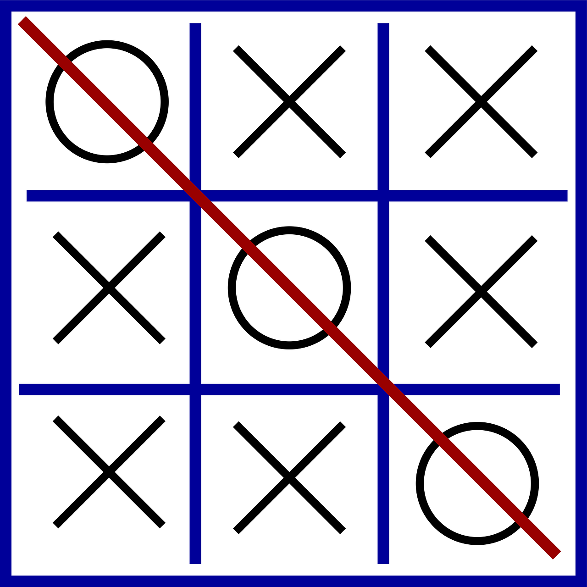

# Tic Tac Toe Game System Requirements

## Overview
The system should allow one human player to play against one bot in a game of Tic Tac Toe.

## Features
- One human player and one bot can play the game.
- The bot has adjustable difficulty levels.
- The human player can undo their last move.
- The game follows the standard rules of Tic Tac Toe.
- The human player starts the game.
- Players take turns making moves.
- The bots move is determined based on its difficulty level:
    - Easy: Randomly selects an available spot.
    - Medium: Makes moves based on basic strategy (e.g., prioritizing winning moves or blocking the opponent).
    - Hard: Makes moves using advanced algorithms (e.g., minimax with alpha-beta pruning).
- Players can't make moves on occupied spots.
- The game ends when:
    - One player achieves a winning combination (3 in a row/column/diagonal).
    - The board is filled (draw).
- After the game ends, players can choose to:
    - Start a new game.
    - Quit the game.

## Implementation
- Backend: [Java,Builder and strategy design ]
- Bot Difficulty Levels: Easy, Medium, Hard
- Undo Mechanism: Human player can undo their last move.

## Additional Notes
- The bots difficulty level should be configurable by the human player.
- The undo feature should be limited to one move per turn.

